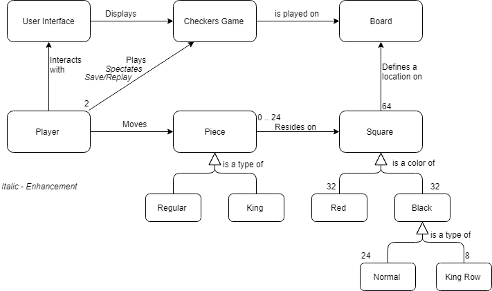
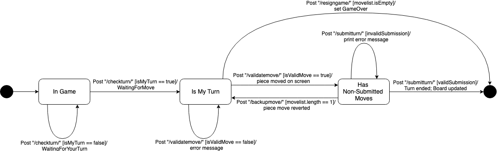
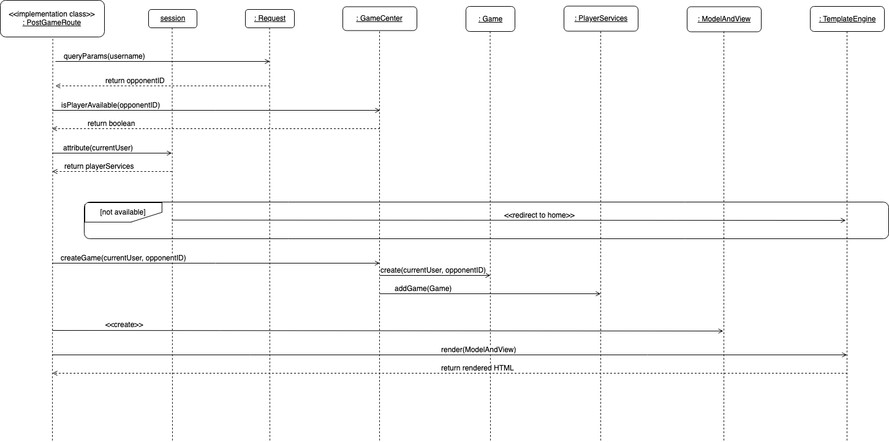
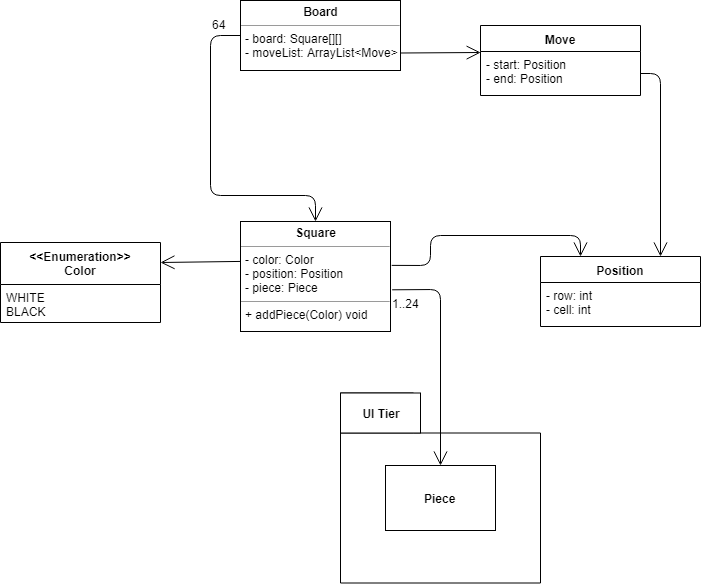

# PROJECT Design Documentation

## Team Information
* Team name: The B Team
* Team members
  * Gunther Kroth
  * Gabriel Diaz
  * Kyle Heberger
  * Andrew Lee

## Executive Summary

This project tasks the development team to create a web application that allows players to play, replay, and spectate checkers games using American rules.

### Purpose
The purpose of this project is to allow players to play and spectate checkers games, and replay the game that was just played in the session. The end user wants to watch and play American rule checkers games with another user. The most important user group is the group of players that are waiting to play or spectate games.

### Glossary and Acronyms

| Term | Definition |
|------|------------|
| VO | Value Object |

## Requirements

This section describes the features of the application.

### Definition of MVP

Players interested in playing checkers on the WebCheckers App will sign in before the play. When they are done playing, they will sign out.\
Once a player is signed in, a list of online players is presented to the user.\
The signed in player will have the option to challenge other users to games.\
All games played on the WebCheckers App follow the American Rules of checkers.\
During a game, a player has the option to resign at any time.\
Once the end of game is reached based on the American Rules of checkers, the game ends and an end game screen is shown to the user.

### MVP Features

Player Sign-in: Using a unique username consisting of alpha-numeric characters, users create their own WebCheckers account.\
Player Lobby: There is a list of players displayed to the currently signed in player that allows them to see all online players and have the option to challenge them to a game.\
Starting a Game: By selecting another user who is also signed on to WebCheckers, the two players will be brought into a checkers game.\
Playing of Turns: Players have to option to move their pieces around the board before they submit their final decision.\
Waiting for opponents: While waiting for an opponent to take their turn, a user has to option to resign from a game at any point.\
Ending the Game: Once an end game condition is reached based on the American rules for playing checkers - one team has no pieces left, one team has no more moves, or someone has resigned - the game ends and the players can exit the game.

### Roadmap of Enhancements

Replay Mode: Game can be saved by a user and reviewed at a later date.\
Spectator Mode: Other players may view an on-going game that they are not participating in.

## Application Domain

This section describes the application domain.

The User Interface entity is the lens in which the user views and interacts with all the other 
entities. This interface is what displays the Checkers Game entity.

The Checkers Game can be played or spectated by the Player entity, and the Board entity is used to
actually play the game.

The Piece entity can be of two types, regular or king, and each of these pieces reside within a 
Square entity that is on the game board. Each Player entity has control of 12 pieces at the start of
the game, and they are the ones that can change which square the pieces are placed on.

The Square entity can be either red or black, with black being the actually playable spaces on
the board. The black squares can be either normal or of type King Row, which would mean they are
spaces at either end of the board where the regular pieces can be promoted to kings.

## Architecture and Design

This section describes the application architecture.

### Summary

The following Tiers/Layers model shows a high-level view of the webapp's architecture.

As a web application, the user interacts with the system using a
browser.  The client-side of the UI is composed of HTML pages with
some minimal CSS for styling the page.  There is also some JavaScript
that has been provided to the team by the architect.

The server-side tiers include the UI Tier that is composed of UI Controllers and Views.
Controllers are built using the Spark framework and View are built using the FreeMarker framework.  The Application and Model tiers are built using plain-old Java objects (POJOs).

Details of the components within these tiers are supplied below.

### Overview of User Interface

This section describes the web interface flow; this is how the user views and interacts
with the WebCheckers application.

(User interface statechart from first accessing the webpage to getting into a game)

The first thing the user sees is the web application's home page. This page provides a link to the
sign in page as well as the number of currently online users.

After moving to the sign in page, the user will be able to input a username of their choosing inside
of the textbox provided on the page. Clicking the submit button will try and assign that chosen
username to the player and redirect them back to the homepage as a logged in user. It may fail,
however, if the username is taken or invalid. This will result in a prompt explaining why the login
failed, and will let them retry.

Once a valid name is chosen, the user will be redirected back to the homepage, but this time a list
of online players will be shown that the user can choose from to start a game with. If the other user
available, their name will be clickable and it will say available next to their name. If they are 
busy, it will say busy next to their name and they cannot be clicked.

If the user clicks on an available player's name, they will be redirected to the game page, where
the other user they clicked on will be redirected to as well. This page shows the full checkerboard
with the users pieces at the bottom of the screen. From here, the game will be able to be played.

(User interface statechart from being in game until the game ends)

After getting into a game, the user will see the board rendered on the screen. If it is their turn, they will be moved into the Is My Turn state, otherwise they will repeatedly refresh and check to see if it is their turn.

Once it becomes the user's turn, they will be able to drag their pieces and attempt to make moves, or resign. If they resign, it will end the game and take them back to the home page. If they attempt to make a move, the postValidateMove route is called. If it is valid, they are moved to the Has Non-Submitted Moves state, if it is not valid, an error message is displayed and they stay in the Is My Turn state.

In the Has Non-Submitted Moves state, the user is able to submit their turn, back up their moves, or continue making moves that will repeatedly call postValidateMove, following similar logic to what has happened in the Is My Turn state. If the user attempts to backup their move, it will take them back to the Is My Turn state if they no longer have any non-submitted moves, or it will leave them in the state they currently are in if there are still moves left in the moveList. Submitting the turn will then end the users turn and update the board if it submits successfuly, or it will print an error message and keep the user in the Has Non-Submitted Moves state if the move cannot be submitted.

### UI Tier

The UI tier is contains all of the URL route handlers for the WebCheckers application, as well as several JS-friendly class representations of a checker board.

(Simplified User Interface Tier UML)

BoardView is an object that is used by the client-side JavaScript to render the checker board. BoardView is divided into Rows, which are then divided into Spaces. A Space may have a Piece reside on it.
Note the association to the model tier Board. Since Board is a more friendly implementation of a checker board, a Board is always translated to a BoardView when information is sent to the client.

Below are two sequence diagrams that show the interactions between classes when a URL route is handled.

This route is handled when a user wants to return to the home page of the WebCheckers application.

This route is use to handle the playing of a checkers game.

### Application Tier

The application tier consists of three classes; PlayerServices, GameCenter, and Game. Each class is used as a 'bridge' between the UI elements and the Model elements.

(Simplified Application Tier UML)

When a user connects to the Web Checkers application, a new PlayerServices object will be created and references between the GameCenter and itself will be established. GameCenter serves as a hub for PlayerServices and Game objects.
When the user chooses to enter a Game with another player, GameCenter will create a new Game and pass it to each PlayerServices object.
When a Game is finished, the Game will be removed from each PlayerServices object.

### Model Tier
Classes in the model tier are used as a server-side representation of a checkers game.

(Simplified Model Tier UML)

The Board class consists of a two-dimensional array of Square Objects. Square objects have a Color (black or white), a Position, and may have a Piece. When Pieces are moved around the Board, they are done so via a Move object.
Notice that Piece resides in the UI module. Piece is used with both the server-side and client-side implementations of a checker board. See the UI Tier UML diagram for more Piece details.
Though it is not pictured in the UML, the ReplayGame class is also placed in the Model package. This class holds specific 'snapshot' Boards that are useful in replaying a user's saved game.

### Design Improvements & Code Metrics

There are a few improvements that could be made to this project if there was more time and it was still being worked on.\
One of these is a small change to the way spectating works. As of right now, regardless of the player who is being spectated, red is at the bottom. It would be a nice change to have white at the bottom if the white player is being spectated.\
Many changes could be made regarding the structure of the code and the classes used within the project.\
The board class ended up being huge with a lot of methods. This class could have been broken up into another logic class that deals with a lot of the actual game logic, rather than giving all the power to the board class.

**Cyclomatic complexity for methods**

(Graph of cyclomatic complexity for each method in the application.)

As seen in the graph above, a large proportion of the methods used have low complexity. Those that have higher numbers are detailed below:

checkForKingJumps, checkForKingSingleMoves, checkForRedJumps, checkForWhiteJumps, etc... - these methods have lots of nested if statements that make them complex. Some double for loops are also used to iterate through each square on the board. These methods require a high degree of complexity because of what they check. They iterate through the entire board and check to see if the player has any available move on the board.

flip - this method is used to flip the orientation of the board for the white player. There are three separate double for loops. One is used to create a toString for debug/test purposes. One is used to create a list of all the squares in the red oriented board, and the final one is used to put this list of squares into a new board, in white's orientation.

**Attribute counts for classes**

WebServer (20) - this is due to the URL routes being stored in constant attributes for easy access.\
PlayerServices (10) - The PlayerServices class is used to keep all of the data on a current WebCheckers user (current game, saved games, spectator/replay, username).\
Game (8) - another large class like PlayerServices, this class holds several vital attributes (GameCenter, P1, P2, Board, BoardView).\
ReplayGame (8) - like Game.

**Coupling for classes**

PlayerServices (30) - this object is used to communicate between the UI and Model tiers. The PlayerServices Route is stored in the HTTP session and is used by each Route to communicate with the server.\
WebServer (20) - 12 of these usages are using the URL routes stores as constants here.\
GameCenter (19) & Game (17) - These are highly used Application-level classes that are 'hubs' of information. Other classes rely on this information and used them as bridges to communicate with other classes.

**Encapsulation**

Method Encapsulation: 14.57% of all methods are visible to all classes. This is a relatively low number and shows that private methods are utilized often to accomplish tasks.\
Attribute Encapsulation: 48.76% of class attributes are visible to all classes. While this number is high, we see this as a consequence of our low method encapsulation ratio. Instead of having public methods, we have public attributes.

## Testing

When testing the various features of the application, two approaches were taken. The first is a more high-level test that examines the implementation of user stories. Acceptance criteria were defined for each user story that would verify its completeness.

Unit testing was used to ensure the accuracy of the code behind the implementation. To encourage a bug-free experience for users, components that directly effect the user's checkers experienced were focused on.

### Acceptance Testing

All 15 of our user stories have passed the acceptance criteria we made. Most of the user stories passed without any fails.\
The major problem that appeared was in the user story of resignation. When a player tried to resign when it wasn't their
turn, the player making the turn would not be notified until they submitted their turn. Another problem was when both players
wanted to resign. When both of the players tried to resign, only one of the players would get sent to home and the other
would be in a loop that just kept on sending them back to the game.

### Unit Testing and Code Coverage

We focused on getting our code coverage numbers above 90% for all tiers, putting special focus on improving the coverage in our model tier classes. Our unit testing strategy included: testing edge cases, testing down each branch, and adding equals and hashCode methods to certain classes to improve testability of the classes. 
All methods that were added for class comparision were fully unit tested and covered down all branches. One of the biggest difficulties to test was our Board class, due to it's large complexity, many branching paths and private methods, some of which we had to change to protected due to time constraints. 
We also encountered a few anomalies, such as: the Application and Message classes, which were given classes with a lower standard of coverage, and the WebServer class which was too daunting a class to test with such a small amount of time.

